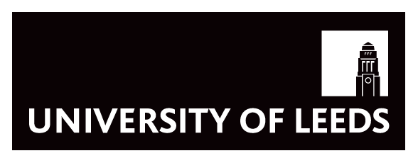

# Group-website
Repo for learning automate website with Github website

## Contents
* [Learning Markdown](#learning-markdown)
* [Carpentries Lesson Programs](#carpentries-lesson-programs)

## Learning Markdown

Vanilla text contain *italics* and **bold**.

This paragraph is separated from the previous one by a blank line. 
Line breaks

are caused by 
[carpentries website](https://carpentries.org/)

### Carpentries Lesson Programs:
1. Software Carpentry
2. 2. Data Carpentry
3. Liberary Capentry
   1. Section 1
   2. Section 2
4. Philosophers Carpentry

University of Leeds, copyright University of Leeds 2022. 
